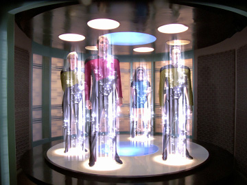

========
Teleport
========

.. note::

     If you're looking to dive right in, check out the `Python docs
     </docs/teleport/python/>`_.

Teleport is:

* A serialization system on top of JSON
* An input validation system
* A declarative schema system
* An aid in automatically generating API docs
* Portable and extendable
* Open Source (`MIT license <http://opensource.org/licenses/MIT>`_)

Teleport is not a serialization *layer*. It provides 9 built-in data types to
get you started, however, using Teleport for a non-trivial project means
defining data types of your own. In object-oriented languages, this involves
augmenting your classes to make them serializable.

Once registered with Teleport, a custom data type will become a first-class
citizen of your application. Defining an array of widgets is just as easy as
defining an array of integers, provided that you made the Widget class
serializable.

Such definitions (like "array of widgets") are also serializable. This feature
is crucial in allowing `Cosmic <http://www.cosmic-api.com/>`_ clients to share
a deeper understanding of each other.

The canonical implementation of Teleport is written in Python.

Motivation
----------

Many languages such as Python or JavaScript do not support static typing. But
Python (to use it as an example) is not without type definitions! Even the
biggest proponent of dynamic typing will admit that it's a good idea to
document the parameter types of public library functions. This kind of static
typing may be adequate for libraries, but web APIs have 3 characteristics that
make them practically beg for more:

1. When a user passes in a wrong value into your library's function, it is
   *their code* failing, even if the stack trace points in your direction.
   When an API call fails in a similar manner, it is your code, your server,
   your database. If data is not checked at input, it may travel deep into
   your code before causing an error, possibly leaving your system in an
   inconsistent state.
2. While libraries need only worry about occasional mistakes, web APIs need to
   consider malicious clients. With this in mind, the idea of the likelihood
   a certain type of input becomes irrelevant. An attacker will craft precicely
   the unlikeliest piece of data in order to make your system fail.
3. Unlike data passed between libraries, web API data needs to be serialized
   and deserialized. Any non-trivial serialization system needs to be
   instructed with regards to the data types, either declaratively with a
   schema or imperatively with a bunch of custom functions.

Assuming that serialization, deserialization and validation code needs to be
written, the question is: how do we structure this code? Teleport is a
solution to precicely this problem.

Design goals:

1. Public functions need not worry about serialization or validation, they
   must take and return rich native data regardless of whether they are called
   remotely or locally.
2. Type information should be specified declaratively, not imperatively.
3. These definitions must be serializable (as *schemas*).
4. Schemas must be well-suited for automatically generating API documentation.
5. The generated JSON must be readable and familiar in a web programming
   context.
6. Teleport should be small and portable.

Principles
----------

.. glossary::

    Serializer

        An object that defines a serialization and deserialization function.
        Together, these functions define the *native form* as well as the
        *JSON form* of one particular type of data. As far as Teleport is
        concerned, a serializer is a data type definition.

        Serializers may take parameters. For example, an array serializer
        needs to know what type of items the array is expected to contain.
        It's these kinds of serializers that allow building deeply nested
        schemas for describing rich internet data.

    Native form

        Data in its rich internal representation. For most built-in types,
        this data will consist of language primitives.

        In object-oriented languages, the native form of user-defined types
        will often take the form of class instances. When you describe your
        classes to Teleport, it will be able to deserialize them from JSON and
        instantiate them for you.

    JSON form

        Data in its JSON represenation. There are many ways to represent the
        same data in JSON. This representation must be unambiguous. Because
        Teleport was designed for web APIs, the JSON data should look familiar
        and be readable as JSON was indeed designed to be.

    Deserialization

        Turning data as provided by the JSON parser into its native form.
        Validation is always performed during this step.

    Serialization

        Turning data in its native form into the format expected by the JSON
        serializer. Validation is *not* performed during this step.

Built-In Types
--------------

Teleport provides 9 built-in types. Each implementation must provide 9
corresponding serializers.

The native form of the built-in types is implementation-dependent and will be
defined in language-specific documentation. The serialized form and the
validation logic, however, is identical across all implementations. Below is a
list of all built-in models and their validation logic.

``integer``
    Must be expressed as a JSON number. If the number has a decimal, the
    fractional part must be 0.

``float``
    Must be expressed as a JSON number. Implementations should support double-precision.

``string``
    Must be expressed as a JSON string. Encoding must be UTF-8. Unicode errors
    must be dealt with strictly by throwing a validation error.

``boolean``
    Must be expressed as a JSON boolean.

``binary``
    Must be expressed as a JSON string containing Base64 encoded binary data.
    Base64 errors must result in a validation error.

``json``
    Can be any JSON value. No validation is performed during deserialization.
    Depending on the implementation, it may be useful to wrap the JSON in a
    different object, so that a ``null`` JSON value won't cause ambiguity.

``array`` (parametrized by *items*)
    Must be expressed as a JSON array. The implementation must deserialize
    each of its items against the *items* serializer. If an item
    deserialization fails with a validation error, the array deserialization
    must fail likewise. The native form of an array must be an ordered
    sequence of native values, in the same order as they appear in the JSON
    form. If the array was empty, an empty sequence must be returned.

``struct`` (parametrized by *fields*)
    Must be expressed as a JSON object. If the object has a key that is
    different from every field name in *fields*, a validation error must be
    thrown. For every key-value pair in the object, the value must be
    deserialized against the *schema* of the corresponding field in *fields*.

    Each field must have a boolean attribute *required*, that, if true, will
    cause the struct to throw a validation error when the corresponding value
    is missing from the data being validated.

    Note that fields are ordered.

    The native form of the object must be a associative array containing all
    key-value pairs from the original object with native values replacing the
    JSON values.

``schema``
    See the following section.

Schemas
-------

.. glossary::

    Schema

        The JSON form of a :term:`serializer`.

A schema is always a JSON object, it must always have a *type* property.
All built-in types except for ``array`` and ``struct`` contain no other
properties.

An ``array`` schema must contain a property *items*, whose value must be a
schema that describes every item in the array.

A ``struct`` schema must contain a property *fields*, which must be an array
of field objects. Each field object must contain 3 properties: *name*,
*schema* and *required*. *Name* must be a string, there cannot be two field
objects in a ``struct`` schema with the same name. *Schema* must be a schema
that describes the value matched by the *name*. *Required* must be a boolean
that specifies whether omitting the item will cause a validation error or not.

To validate ``[{"name": "Rose"}, {"name": "Lily"}]``, you could use the
following schema:

.. code:: json

    {
        "type": "array",
        "items": {
            "type": "struct",
            "fields": [
                {
                    "name": "name",
                    "schema": {"type": "string"},
                    "required": true
                }
            ]
        }
    }

Implementation Notes
--------------------

How to validate schema parameters is up to the implementation. However, it
should be noted that these parameters can be described as Teleport schemas
themselves. For example, *fields* can be described as follows:

.. code:: json

    {
        "type": "array",
        "items": {
            "type": "struct",
            "fields": [
                {
                    "name": "name",
                    "schema": {"type": "string"},
                    "required": true
                },
                {
                    "name": "schema",
                    "schema": {"type": "schema"},
                    "required": true
                },
                {
                    "name": "required",
                    "schema": {"type": "boolean"},
                    "required": true
                }
            ]
        }
    }

Note that after using the above schema the implementation still needs to make
sure there are no duplicate names.

