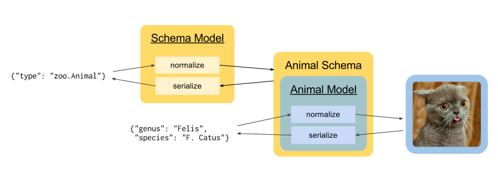

Teleport
========

Teleport is a JSON-based extendable system for cross-language serialization
and validation. Teleport is not a serialization *layer*. Using Teleport for a
non-trivial project involves defining data types. In object-oriented
languages, this involves augmenting your classes to make them serializable.

The canonical implementation of Teleport is written in Python.

.. glossary::

    Model

        A data type definition that consists of a normalization and a
        serialization function. The output of a model's normalization function
        must be of the same form as the input of its serialization function.
        Together, these functions define the *native form* of the data.

    Native form

        Data in its rich internal representation. For most built-in types,
        this data will consist of language primitives. In object-oriented
        languages, native data will often take the form of class
        instances.

    Normalization

        Turning data as provided by the JSON parser into its native form.
        Validation is always performed during this process.

    Serialization

        Turning native data into the form expected by the JSON serializer.

Built-In Types
--------------

Cosmic provides 9 built-in types. Each implementation must provide 9
corresponding models, each model containing a serialization and a
normalization function.

The native form of the built-in types is implementation-dependent and will be
defined in language-specific documentation. The serialized form and the
validation logic, however, is identical across all implementations. Below is a
list of all built-in models and their validation logic.

``integer``
    Must be expressed as a JSON number. If the number has a decimal, the
    fractional part must be 0.

``float``
    Must be expressed as a JSON number. Implementations should support double-precision.

``string``
    Must be expressed as a JSON string. Encoding must be UTF-8. Unicode errors
    must be dealt with strictly by throwing a validation error.

``boolean``
    Must be expressed as a JSON boolean.

``binary``
    Must be expressed as a JSON string containing Base64 encoded binary data.
    Base64 errors must result in a validation error.

``array`` (parametrized by *items*)
    Must be expressed as a JSON array. The implementation must normalize each
    of its items against the *items* schema. If an item normalization fails
    with a validation error, the array normalization must fail too. The native
    form of an array must be an ordered sequence of native values, in the same
    order as they appear in the JSON form. If the array was empty, an empty
    sequence must be returned.

``object`` (parametrized by *properties*)
    Must be expressed as a JSON object. If the object has a key that is
    different from every property name in *properties*, a validation error
    must be thrown. Likewise, if *properties* has a property whose
    name is not a key in the object, a validation error must be thrown. For
    every key-value pair in the object, the value must be normalized against
    the *schema* of the corresponding property in *properties*. The native 
    form of the object must be an associative array containing all key-value
    pairs from the original object with native values.

``json``
    Can be any JSON value. No validation is performed during normalization.
    Depending on the implementation, it may be useful to wrap the JSON in a
    different object, so that a ``null`` JSON value won't cause ambiguity.
    See :ref:`null-ambiguity` below.

``schema``
    See the following section.

Schemas
-------

.. glossary::

    Schema

        An object capable of normalizing and serializing complex JSON data. A
        recursive JSON structure that mirrors the data it is meant to
        validate.

Because schemas need to be passed over the wire, they are implemented as
models. Like any models, schemas have a native form and a JSON form. The
native form of a schema must provide methods to normalize and serialize data
that the schema describes, this is the primary function of the schema.
Internally, however, these methods delegate their work to the actual model
whose data the schema describes. A native schema object is effectively a
wrapper for a model:

The way the native form of the schema works is up to the implementation. The
serialized form (JSON form) is the primary way of dealing with schemas and
will work across implementations. From this point on, *schema* will refer to
the serialized form.

In plain English, a schema is always a JSON object, it must always have a
*type* attribute. An array schema also requires an *items* attribute, which
will be a schema that describes every item in the matched array. An object
(associative array) schema requires a *properties* attribute, which will be an
array of objects describing each property of the data.

Below is the grammar for a JSON schema:

.. _schema-grammar:

.. productionlist:: schema
    schema: `simple_schema` | `array_schema` | `object_schema`
    simple_type: '"integer"' | '"float"' | '"string"' | '"boolean"' | '"binary"' |
               : '"json"' | '"schema"' | `identifier` '.' `identifier`
    simple_schema: '{' '"type"' ':' `simple_type` '}'
    array_schema: '{' '"type"' ':' '"array"' ',' '"items"' ':' `schema` '}'
    object_schema: '{' '"type"' ':' '"object"' ',' '"properties"' ':' '[' `properties` ']' '}'
    properties: `property` | `property` ',' `properties`
    property: '{' '"name"'     ':' `string` ','
            :     '"schema"'   ':' `schema` '}'
    identifier: [A-Za-z0-9_]+

.. note::
    An object schema cannot define two properties with the same name. Trying to
    normalize such a schema must result in a validation error. The two identifiers
    above correspond to the API name and a name of the API's model. This makes it
    possible to reference models like so: ``{"type": "tweeter.Twit"}``.

When an external model is referenced, Cosmic will find the model and plug it
into the resulting schema object. If the model belongs to an external API,
Cosmic will fetch its schema and build a dummy for the schema object.

To validate ``[{"name": "Rose"}, {"name": "Lily"}]``, you could use the
following schema:

.. code:: json

    {
        "type": "array",
        "items": {
            "type": "object",
            "properties": [
                {
                    "name": "name",
                    "schema": {"type": "string"}
                }
            ]
        }
    }

.. _null-ambiguity:

A Word About Null
-----------------

The only place where ``null`` is allowed within JSON-serialized data is in a
``json`` model. Anywhere else, ``null`` will result in a validation error. If
there is no data for an optional property, it must be omitted from the
payload.

The reason for this rigid rule is to avoid ambiguity between ``null`` as an
absense of value and ``null`` as an explicit value. For example, to
distinguish between an empty request body and a 4-character request body that
reads ``null``. In JavaScript, these entities are represented by ``null`` and
``undefined`` respectively. In many other languages this distinction does not
exist.

In most implementations, ``null`` may be used in the native form to denote an
absense of value. For example, one might set an object property to ``null`` to
remove it from the object. During serialization, these properties will be
omitted. The only time where this may cause trouble is if the property is of
type ``json``. Will the serializer omit it or treat it as an explicit value?

In the canonical Python implementation, the ambiguity is resolved by wrapping
the JSON value in an object. Even if the JSON value is ``null``, the object is
there to show that it is an explicit value. If the place of the object is
taken by a native ``null`` (``None`` in Python), the system sees that no value
was passed.

Implementation Notes
--------------------

While parsing the schema :ref:`grammar <schema-grammar>` is entirely up to the
implementations, it should be noted that the structure of a JSON schema can be
validated by a meta-schema. This is how the canonical Python implementation
works. Below is the same grammar as above, described in terms of a JSON schema.

For a simple schema:

.. code:: json

    {
        "type": "object",
        "properties": [
            {
                "name": "type",
                "schema": {"type": "string"}
            }
        ]
    }

An array schema (note how it refers to ``{"type": "schema"}`` for the *items*
property):

.. code:: json

    {
        "type": "object",
        "properties": [
            {
                "name": "type",
                "schema": {"type": "string"}
            },
            {
                "name": "items",
                "schema": {"type": "schema"}
            }
        ]
    }

An object schema:

.. code:: json

    {
        "type": "object",
        "properties": [
            {
                "name": "type",
                "schema": {"type": "string"}
            },
            {
                "name": "properties",
                "schema": {
                    "type": "array",
                    "items": {
                        "type": "object",
                        "properties": [
                            {
                                "name": "name",
                                "schema": {"type": "string"}
                            },
                            {
                                "name": "required",
                                "schema": {"type": "boolean"}
                            },
                            {
                                "name": "schema",
                                "schema": {"type": "schema"}
                            }
                        ]
                    }
                }
            }
        ]
    }

